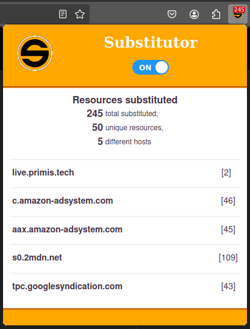

# Substitutor - 2024

## !! Moved project to: https://github.com/CBA-UPC/eprivo-cleaner !!

Updated version of the substitutor Firefox plugin, from the ePrivo project.



### Plugin generation (LINUX)

Give permissions and execute "make_plugin.sh" ("zip" package is needed)

```
chmod +x make_plugin.sh
./make_plugin.sh
```

### Plugin loading (FIREFOX)

Open a firefox tab and follow the steps:

Navigate to about:debugging > "This Firefox" > "Load Temporary Add-on" and select plugin.xpi file
